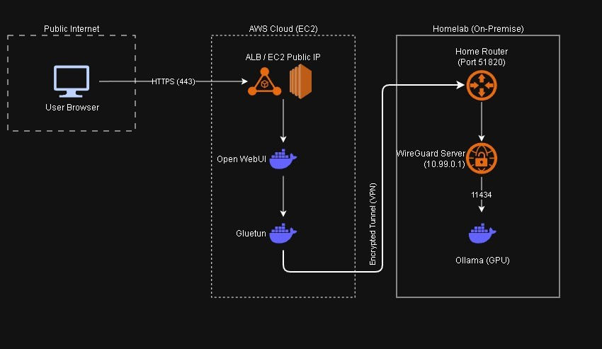

# Ollama AWS Hybrid Deployment

This project provides a hybrid LLM deployment that runs your large language models locally on a home machine while exposing a user‑friendly web interface via an AWS EC2 instance. The setup uses **Gluetun** to establish a WireGuard tunnel from the EC2 host to the local Ollama service, allowing Open WebUI to connect to the models securely over the internet.

## Architecture Overview



**EC2 Instance**:
- Gluetun runs inside the instance and creates a secure tunnel to the local network.
- Open‑WebUI runs inside the same compose stack and shares a container network with Gluetun (`network_mode: "service:gluetun"`), so it can communicate with the tunnel.

**Local**:
- Ollama is exposed on the LAN (e.g., `http://192.168.1.100:11434`) and is reachable from the EC2 instance through the WireGuard tunnel.

## Configuration

**EC2 Instance**:
- `OLLAMA_BASE_URL` must point to the **local** Ollama instance.  

_See full configuration [here](./docker-compose.yml)_

**Local**:

- The local compose stack should include Open WebUI to adjust permissions, troubleshoot, etc. 
- Only variation from [standard configuration](../ollama-openwebui/docker-compose.yml) is setting `network_mode: host` in the compose file to make ollama reachable via IP from the EC2 instance.

```yaml
# Running on local node
services:
  ollama:
    network_mode: host
```

### Environment Variables

**IMPORTANT**: Any IP that is being used for the health check during the gluetun startup must be included in `WIREGUARD_ALLOWED_IPS`. For simplicity (and to whitelist Cloudflare DNS), I've opted for 1.1.1.1/32 in the example [env file](./.env.example). Without a passing the healthcheck, the VPN connection will be unstable.
